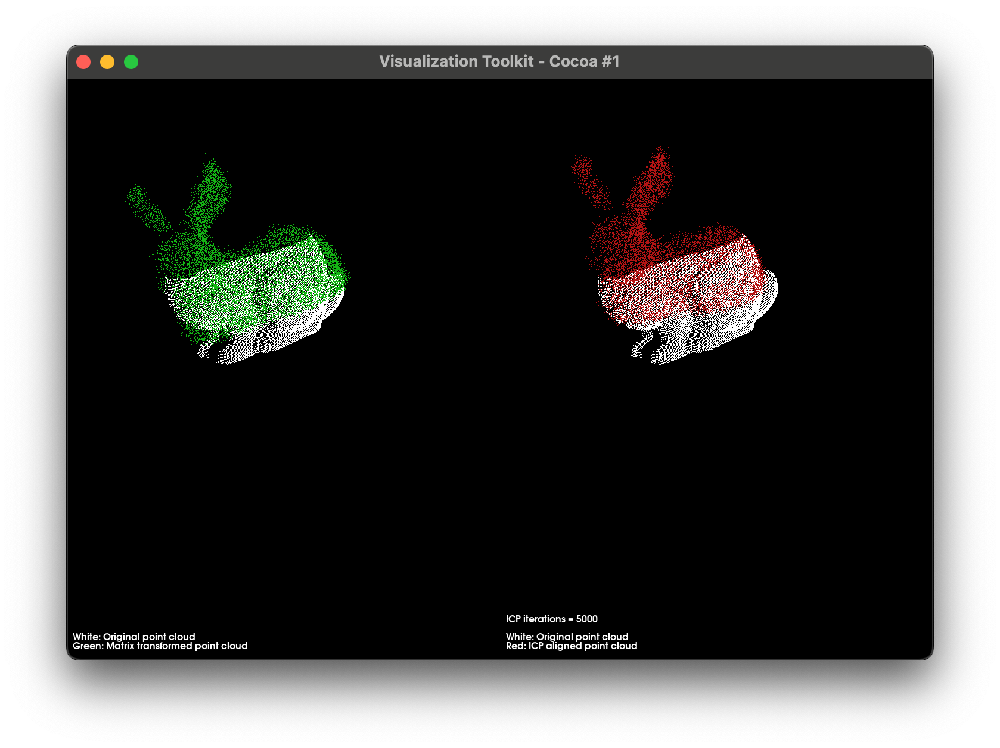

# project-hug

## Description
This project is an implementation the Iterative Closest Point (ICP) and Trimmed Iterative Closest Point (TrICP) algorithms for Euclidean registration of two 3D point clouds.

The code for this project is written in C++ and utilizes Eigen and PCL for matrix operations and point cloud operations respectively. The solution is built using CMake, allowing easy cross-platform use.

## Requirements
- Working C++ compiler (C++ 17 or greater)
- CMake (version >= 2.8)
- Eigen
- PCL

## Usage
- `./icp model.ply data.ply <ICP alg. version (0 for ICP, 1 for TrICP)> <rotation (M_PI/rotation)> <translation> <stddev> <mean> <number_of_ICP_iterations>`

|  | 
|:--:| 
| *Example output* |
